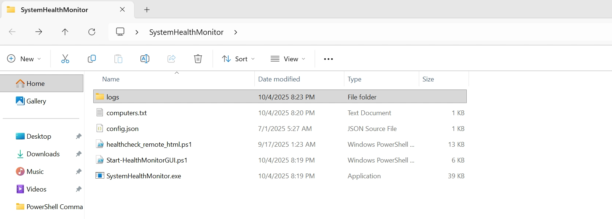
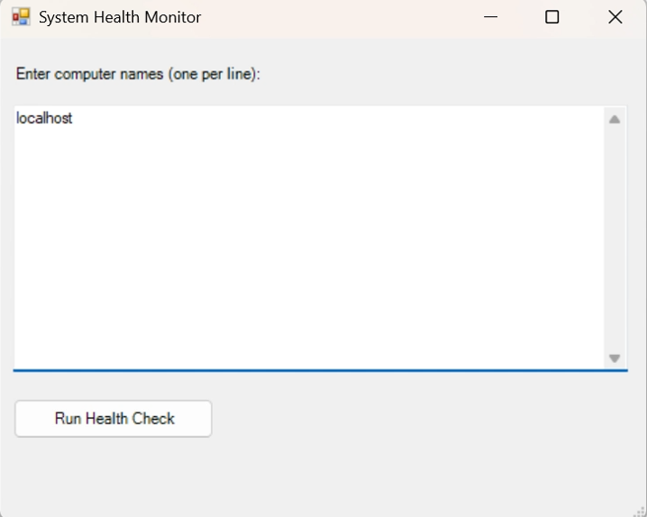
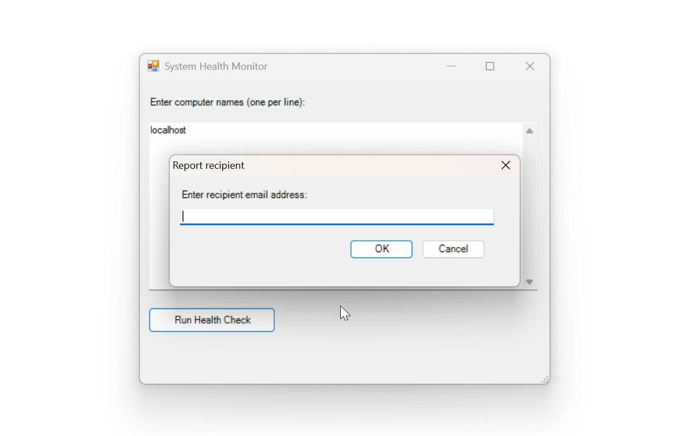
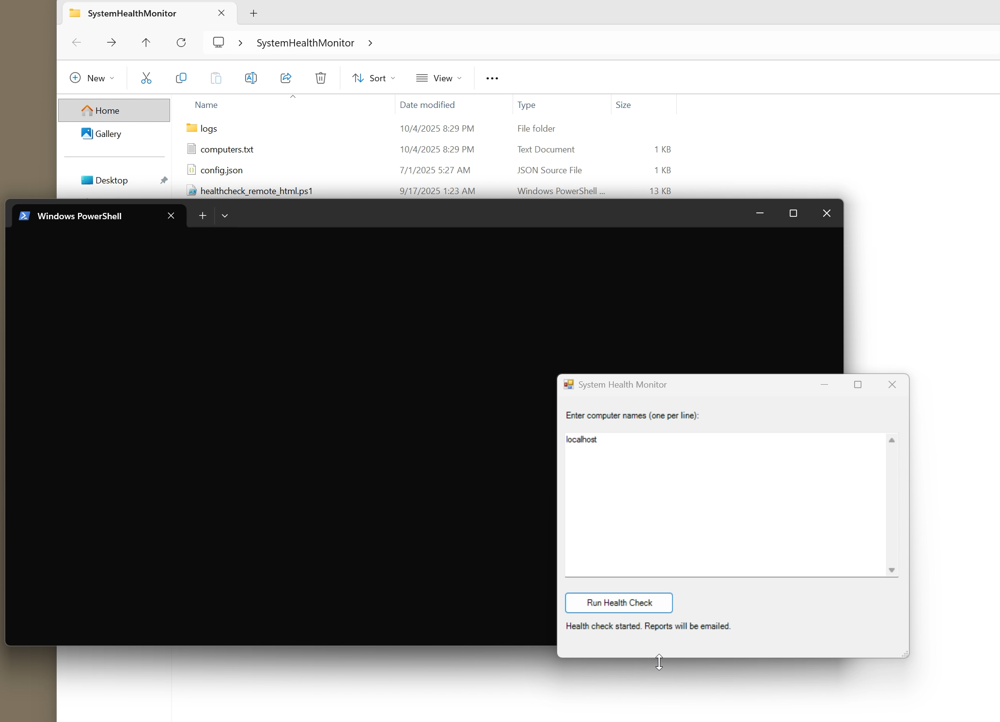
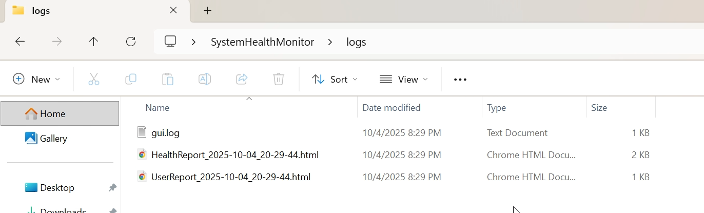
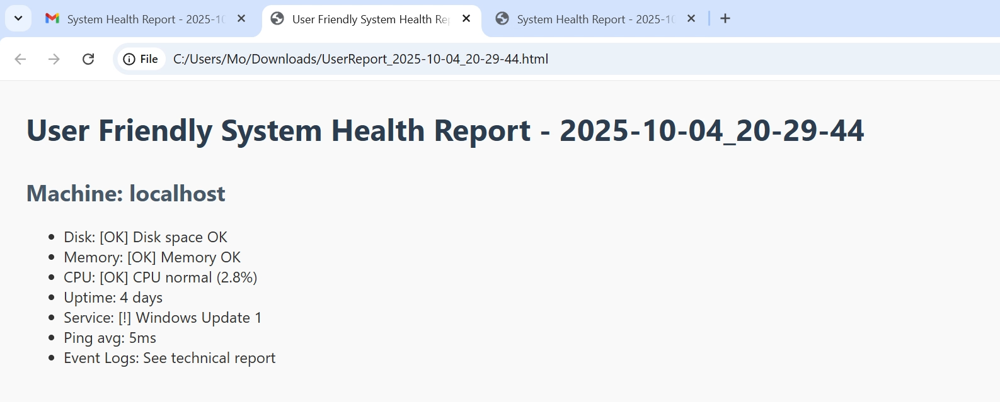
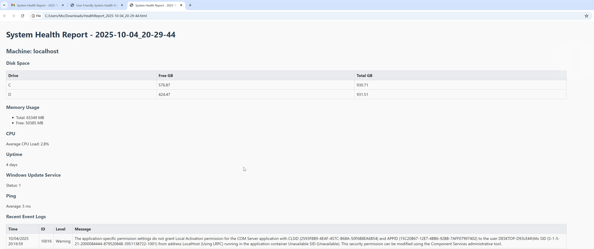
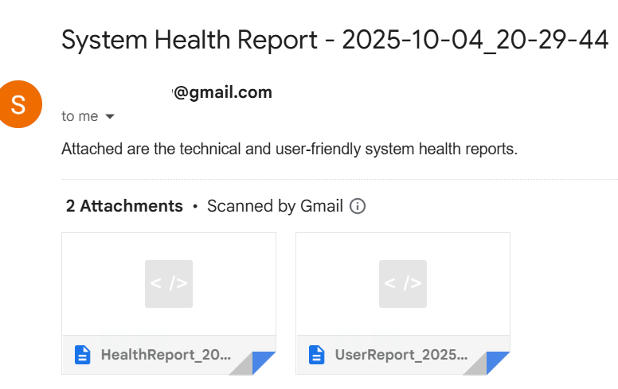

# 🌸 System Health Monitor  

[]() 
[]()
[]()
[](LICENSE)

A professional PowerShell-based application for monitoring **system health**, generating **HTML reports**, and automatically emailing results — all through a user-friendly **Windows GUI**.

---

## 🧠 Overview  

The **System Health Monitor** automates system diagnostics and reporting.  
It checks CPU usage, memory, disk space, uptime, Windows Update status, and event logs — then produces detailed technical and user-friendly HTML reports.  

This project demonstrates PowerShell automation, GUI development, and email integration — ideal for system administrators, IT support, and DevOps professionals.

---

## ✨ Features  

✅ Parallel health checks on multiple remote or local computers  
✅ Interactive **Windows GUI** (built with .NET Forms)  
✅ Dual HTML report generation — *Technical* & *User Friendly*  
✅ Automated **email delivery** via SMTP  
✅ Log tracking with timestamps for each run  
✅ Portable `.exe` build option (for demo or deployment)  

---

## 💻 Tech Stack  

| Layer | Technology |
|-------|-------------|
| Scripting | PowerShell 5+ |
| Interface | Windows Forms (.NET) |
| Reporting | HTML / CSS |
| Communication | SMTP (Email Delivery) |
| Logging | File-based, Auto-timestamped |

---

## ⚙️ Getting Started  

### 🟦 1️⃣ Clone the Repository  
```bash
git clone https://github.com/MoustafaObari/SystemHealthMonitor.git
cd SystemHealthMonitor
```

---

### 🟦 2️⃣ Configure Email Settings  
Edit the `config.json` file with your SMTP details:  
```json
{
  "smtpServer": "smtp.gmail.com",
  "smtpPort": 587,
  "smtpUser": "@gmail.com",
  "smtpPass": "",
  "from": "@gmail.com"
}
```
💡 *Leave it blank for demo/testing — it’s safe to upload empty.*

---

### 🟦 3️⃣ Add Target Computers  
List each machine (or `localhost`) in `computers.txt`:  
```bash
localhost
Server01
Workstation05
```

---

### 🟦 4️⃣ Run the App  

Execute the GUI launcher:  
```bash
.\Start-HealthMonitorGUI.ps1
```

Or use the packaged `.exe` version:  
```bash
SystemHealthMonitor.exe
```

---

## 🎥 Demo Video  

📺 Watch the live walkthrough:  
🎬 [**System Health Monitor Demo**](https://github.com/MoustafaObari/SystemHealthMonitor/blob/main/System%20Health%20Demo.mp4)  

*(or view `System Health Demo.mp4` inside the repository)*  


---

## 🖼️ Screenshots  

| Folder Structure | GUI Launcher | Email Prompt |
|------------------|--------------|---------------|
|  |  |  |

| Running Check | Logs Folder | User-Friendly Report |
|----------------|--------------|-----------------------|
|  |  |  |

| Technical Report (Detailed View) | Generated HTML Reports Summary |
|----------------------------------|--------------------------------|
|  |  |


---

## 📘 Screenshot Descriptions  

| # | Screenshot | Description |
|---|-------------|-------------|
| 1 | Folder structure | Full project files view |
| 2 | GUI window | Main interface with computer name entered |
| 3 | Email dialog | Prompt for recipient email |
| 4 | Script execution | PowerShell window showing jobs running |
| 5 | Logs folder | Shows generated HTML reports |
| 6 | Technical HTML report | Opened in browser |
| 7 | User-Friendly HTML report | Opened in browser |

---

## 🧩 Planned Enhancements  

- Add **CPU trend charts** (HTML graph visualization)  
- Integrate **remote WMI queries** for deeper hardware stats  
- Optional **Teams/Slack notifications** after each run  
- Scheduled monitoring via **Task Scheduler** integration  

---

## 👨‍💻 Developer  

**Moustafa Obari**  
Software Engineer • Cloud & Automation Enthusiast  

🔗 [GitHub](https://github.com/MoustafaObari)  
🔗 [LinkedIn](https://www.linkedin.com/in/moustafaobari)

---

> *“Simplifying IT monitoring through automation, clarity, and intelligent reporting.”*

