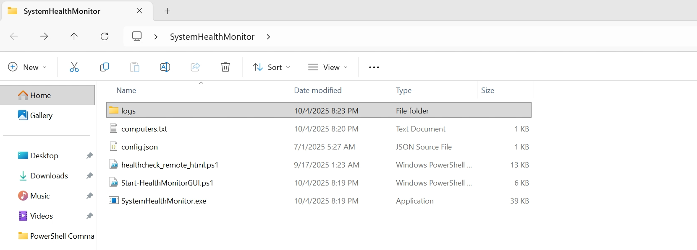
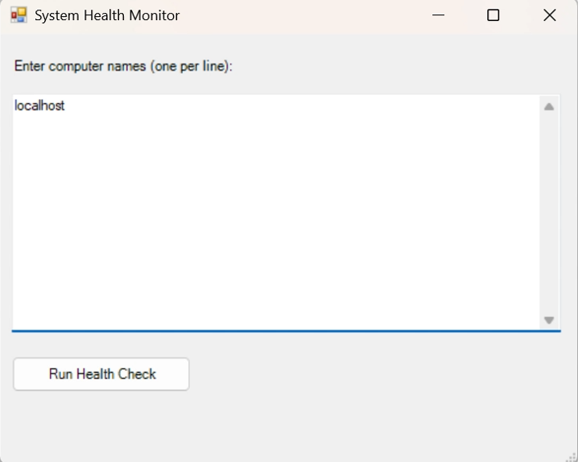
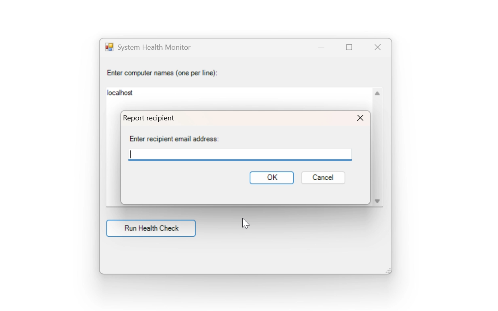
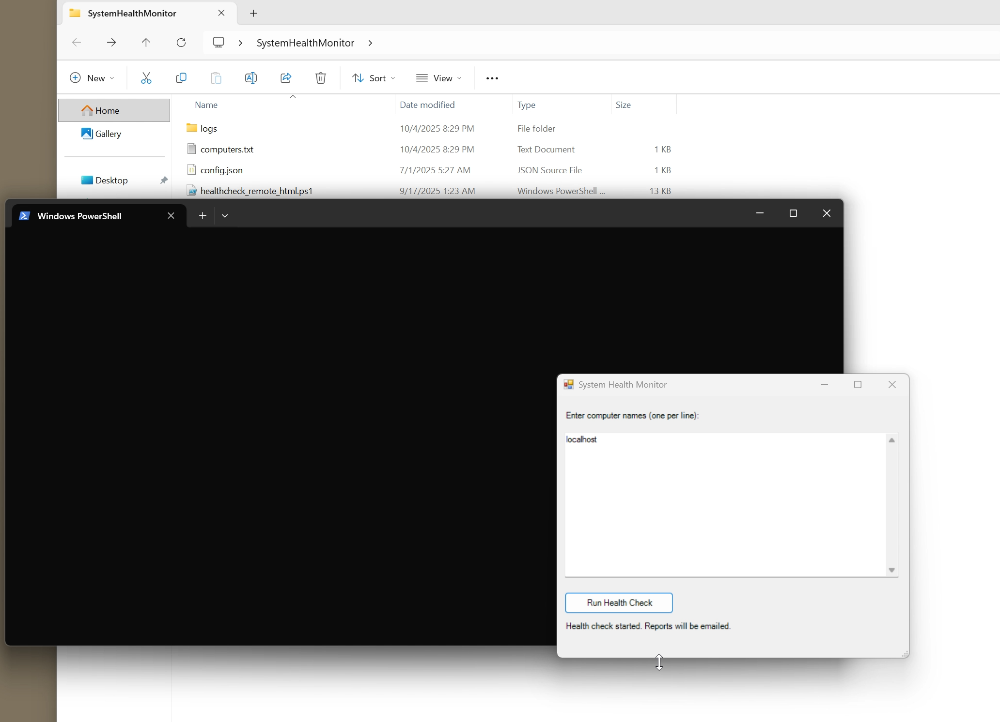
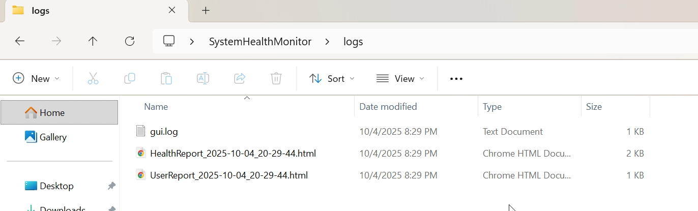
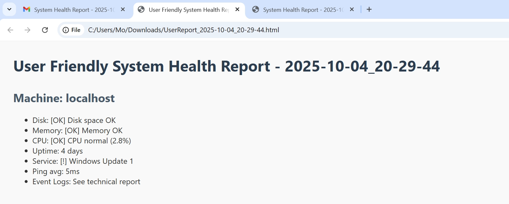
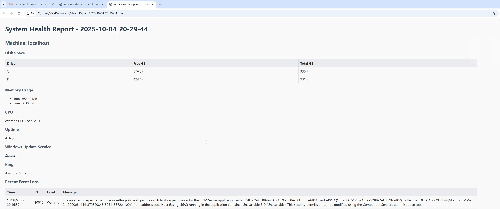
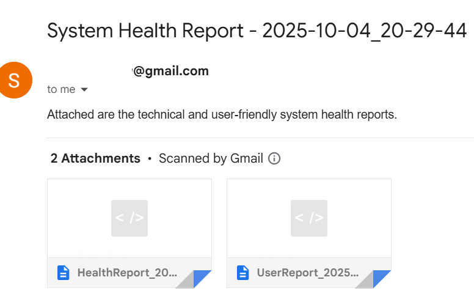

<a id="top"></a>

<p align="center">
  
</p>

<p align="center">
  <a href="https://github.com/MoustafaObari/SystemHealthMonitor">
    
  </a>
</p>

<h4 align="center">PowerShell-based endpoint health monitoring for clear, repeatable, and support-ready troubleshooting 🧩</h4>

<p align="center">
  <a href="#overview">Overview</a> • 
  <a href="#use-cases">Use Cases</a> • 
  <a href="#features">Features</a> • 
  <a href="#tech-stack">Tech Stack</a> • 
  <a href="#health-check-workflow">Workflow</a> • 
  <a href="#getting-started">Setup</a> • 
  <a href="#demo-video">Demo</a> • 
  <a href="#screenshots">Screenshots</a> • 
  <a href="#support-workflow">Support Workflow</a> • 
  <a href="#validation-evidence">Validation</a> • 
  <a href="#security-design-and-scope-control">Security</a> • 
  <a href="#planned-enhancements">Enhancements</a> • 
  <a href="#developer">Developer</a>
</p>

---

<p align="center">
  
  
  
  
  
</p>

<p align="center">
  
  
  
  
</p>

---

<a id="overview"></a>

## 🧠 Overview

**System Health Monitor** is a PowerShell-based endpoint health monitoring tool designed to help IT Support and Desktop Support teams review system status, identify common endpoint issues, and generate clear support-ready reports.

This project was built around a practical IT Support scenario:

> A technician needs a repeatable way to check endpoint health, capture key system metrics, generate documentation, and share results for troubleshooting or handoff.

The tool collects and reports on common workstation/server health indicators, including:

- CPU utilization
- Memory usage
- Disk space and disk health indicators
- Windows Update status
- System uptime
- Critical event logs
- Basic endpoint readiness information
- Local report output for support review

The goal is not to replace enterprise monitoring platforms. The goal is to demonstrate a practical PowerShell support workflow that turns manual health checks into a repeatable, documented process.

---

<a id="use-cases"></a>

## 💼 Use Cases

| Use Case | What This Project Demonstrates |
|---|---|
| **IT Support / Help Desk** | Review endpoint health before or after troubleshooting a user issue. |
| **Desktop Support** | Capture system diagnostics, uptime, disk usage, and event log evidence. |
| **Endpoint Support** | Generate repeatable reports for workstation or small lab checks. |
| **Incident Triage** | Quickly review common system indicators during performance or stability complaints. |
| **Documentation & Handoff** | Save reports and logs that another technician can review. |
| **Lab Automation** | Demonstrate how PowerShell can automate recurring support checks. |

---

<a id="features"></a>

## ✨ Features

✅ **Endpoint Health Checks:** Review CPU, RAM, disk usage, uptime, and system status.  
✅ **Windows Forms GUI:** Simple technician-friendly interface for launching checks.  
✅ **HTML Report Generation:** Creates readable reports for support review.  
✅ **Detailed Technical Report:** Captures deeper diagnostic information for IT staff.  
✅ **User-Friendly Summary:** Produces simplified output for easier review.  
✅ **Timestamped Logs:** Saves output for documentation and later troubleshooting.  
✅ **Optional Email Reporting:** Supports SMTP-based report delivery when configured.  
✅ **Portable Workflow:** Can be run as scripts or packaged into an executable-style support tool.  

---

<a id="tech-stack"></a>

## 💻 Tech Stack

| Layer | Technology |
|---|---|
| **Scripting & Automation** | PowerShell 5.1+ |
| **Interface** | Windows Forms (.NET) |
| **Endpoint Platform** | Windows 10/11, Windows Server basics |
| **Diagnostics** | CPU, memory, disk, uptime, event logs, update status |
| **Reporting** | HTML / CSS |
| **Logging** | File-based timestamped output |
| **Communication** | SMTP Email Delivery |
| **Packaging** | PS2EXE for portable deployment |
| **Documentation** | Markdown, screenshots, demo video |

---

<a id="health-check-workflow"></a>

## 🧭 Health Check Workflow

```text
Technician / Support User
        |
        v
Launch GUI or PowerShell Script
        |
        v
Select Target Computer List
        |
        v
Run Endpoint Health Checks
        |
        v
Collect CPU, Memory, Disk, Uptime, Updates, and Event Logs
        |
        v
Generate Technical HTML Report
        |
        v
Generate User-Friendly Summary
        |
        v
Save Logs and Report Output
        |
        v
Optional Email Delivery
        |
        v
Support Review and Handoff
```

| Phase | Purpose |
|---|---|
| **Prepare Targets** | Add local or remote machines to `computers.txt`. |
| **Run Health Check** | Launch the GUI or PowerShell script to begin system diagnostics. |
| **Collect Metrics** | Gather system health information such as CPU, RAM, disk, uptime, and event logs. |
| **Generate Reports** | Create technical and simplified HTML reports for review. |
| **Save Evidence** | Store logs and generated reports for support documentation. |
| **Notify Support Team** | Optionally send report output through SMTP email. |

---

<a id="repository-structure"></a>

## 📁 Repository Structure

```text
SystemHealthMonitor/
│
├── README.md
├── LICENSE
├── .gitignore
│
├── Start-HealthMonitorGUI.ps1
├── healthcheck_remote_html.ps1
├── config.json
├── computers.txt
│
├── System Health Demo.mp4
│
└── Screenshots/
    ├── 1.png
    ├── 2.png
    ├── 3.png
    ├── 4.png
    ├── 5.png
    ├── 6.png
    ├── 7.png
    └── 8.png
```

Generated reports and runtime logs should remain local and should not include production credentials, company endpoint data, or private user information.

---

<a id="getting-started"></a>

## ⚙️ Getting Started

### 🟦 1️⃣ Clone the Repository

```bash
git clone https://github.com/MoustafaObari/SystemHealthMonitor.git
cd SystemHealthMonitor
```

### 🟦 2️⃣ Configure Email Settings Optional

Email reporting is optional. To use it, update `config.json` with your SMTP settings.

```json
{
  "smtpServer": "smtp.gmail.com",
  "smtpPort": 587,
  "smtpUser": "example@gmail.com",
  "smtpPass": "your-app-password",
  "from": "example@gmail.com"
}
```

Do not commit real SMTP usernames, passwords, app passwords, tokens, or production credentials.

For Gmail, use an app password instead of your normal account password.

### 🟦 3️⃣ Add Target Computers

List endpoints to monitor in `computers.txt`:

```text
localhost
Server01
Workstation05
```

For a lab demo, `localhost` is enough to validate the workflow.

### 🟦 4️⃣ Run the Application

Run through PowerShell:

```powershell
powershell -ExecutionPolicy Bypass -File .\Start-HealthMonitorGUI.ps1
```

Or run the packaged executable if available:

```text
SystemHealthMonitor.exe
```

---

<a id="demo-video"></a>

## 🎥 Demo Video

📺 Watch a quick walkthrough:

🎬 [**System Health Monitor Demo**](https://github.com/MoustafaObari/SystemHealthMonitor/blob/main/System%20Health%20Demo.mp4)

*Recorded in a lab environment and demonstrates the GUI workflow, endpoint checks, generated reports, and email/report output.*

---

<a id="screenshots"></a>

## 🖼️ Screenshots

| Folder Structure | GUI Launcher | Email Prompt |
|---|---|---|
|  |  |  |

| Running Check | Logs Folder | User-Friendly Report |
|---|---|---|
|  |  |  |

| Technical Report Detailed View | Generated HTML Reports Summary |
|---|---|
|  |  |

---

<a id="screenshot-descriptions"></a>

## 📘 Screenshot Descriptions

| # | Screenshot | Description |
|---|---|---|
| 1 | Folder Structure | Shows the complete project structure with scripts and assets. |
| 2 | GUI Launcher | Shows the main interface used to select and monitor systems. |
| 3 | Email Prompt | Shows the recipient and SMTP email configuration prompt. |
| 4 | Running Check | Shows PowerShell running the health check workflow. |
| 5 | Logs Folder | Shows the output folder with timestamped reports. |
| 6 | Technical Report | Shows the detailed metric view for IT administrators. |
| 7 | User-Friendly Report | Shows a simplified report for easier review. |
| 8 | Email Summary | Shows confirmation of generated report output. |

---

<a id="support-workflow"></a>

## 🧪 Support Workflow

This project follows a practical endpoint health review workflow that a technician could use during troubleshooting, routine checks, or support handoff.

| Step | Technician Action | Support Value |
|---|---|---|
| **1. Identify Issue** | Determine whether the endpoint needs performance, stability, disk, or update review. | Creates a clear troubleshooting objective. |
| **2. Select Target** | Add the endpoint to `computers.txt` or validate the local machine. | Keeps the health check scope controlled. |
| **3. Run Tool** | Launch the GUI or script to collect health information. | Supports repeatable system checks. |
| **4. Review Metrics** | Check CPU, memory, disk, uptime, updates, and event logs. | Helps identify common endpoint health issues. |
| **5. Generate Report** | Create HTML reports for technical and simplified review. | Produces readable support evidence. |
| **6. Save Output** | Keep logs and reports for documentation. | Supports future troubleshooting and handoff. |
| **7. Share Results** | Send reports through email if configured. | Makes results easier to communicate. |

---

<a id="validation-evidence"></a>

## ✅ Validation Evidence

The project includes screenshots and report evidence showing the tool working end-to-end.

| Evidence Area | What Was Captured | Why It Matters |
|---|---|---|
| **Folder Structure** | Project files, scripts, and screenshots | Shows the tool is organized and repeatable. |
| **GUI Launch** | Windows Forms interface loading successfully | Confirms technician-friendly operation. |
| **Email Prompt** | SMTP/report recipient workflow | Shows optional report delivery capability. |
| **PowerShell Execution** | Health check running from PowerShell | Confirms the tool performs diagnostic tasks. |
| **Logs Folder** | Timestamped output files | Provides evidence for support review. |
| **Technical Report** | Detailed HTML metric report | Helps technicians review system health. |
| **User-Friendly Report** | Simplified health summary | Makes output easier to understand and share. |
| **Generated Report Summary** | Report output confirmation | Confirms the workflow produces documented results. |

---

<a id="security-design-and-scope-control"></a>

## 🔐 Security Design and Scope Control

### Why this project uses a controlled lab workflow

This project is designed as a support automation lab, not a production enterprise monitoring platform. In real environments, endpoint monitoring should follow approved security, privacy, change management, and access control procedures.

The safer design choices are:

- ✅ Use a controlled list of target machines.
- ✅ Keep credentials and SMTP secrets out of the repository.
- ✅ Generate local logs and reports for review.
- ✅ Use PowerShell execution intentionally instead of hiding actions.
- ✅ Document system checks for troubleshooting and support handoff.
- ✅ Avoid claiming production-scale monitoring without enterprise tooling.

### What this project proves

- The tool can launch from a GUI.
- A technician can run repeatable endpoint health checks.
- Common system metrics can be collected.
- HTML reports can be generated.
- Logs can be saved for documentation.
- Email reporting can be integrated.
- The workflow is repeatable and documentable.

### What this project does not claim

- It is not a replacement for Microsoft Intune, SCCM, RMM, SIEM, or enterprise monitoring platforms.
- It does not store production credentials.
- It does not include real company endpoint data.
- It does not collect private user data.
- It does not bypass endpoint security controls.
- It does not claim production monitoring at enterprise scale.

---

<a id="what-i-learned"></a>

## 🧠 What I Learned

This project strengthened my understanding of:

- PowerShell scripting for endpoint health checks.
- Windows Forms GUI design for technician-friendly tools.
- Collecting CPU, memory, disk, uptime, update, and event log information.
- Creating HTML reports that are readable for support review.
- Saving timestamped logs for documentation and handoff.
- SMTP email reporting and safe configuration handling.
- Structuring support scripts so troubleshooting steps are easier to repeat.
- Presenting technical evidence clearly in a GitHub portfolio project.

---

<a id="resume-summary-version"></a>

## 📄 Resume Summary Version

Built a PowerShell-based system health monitoring tool for endpoint health checks, CPU/RAM/disk review, uptime validation, event log review, HTML report generation, optional SMTP email reporting, and technician-friendly troubleshooting documentation.

---

<a id="skills-demonstrated"></a>

## 🎯 Skills Demonstrated

| Category | Skills |
|---|---|
| **PowerShell Automation** | Health check scripting, endpoint diagnostics, logging, and report generation |
| **Endpoint Support** | CPU, RAM, disk, uptime, update, and event log review |
| **Windows Support** | Windows Forms GUI, local machine testing, Windows system diagnostics |
| **Reporting** | HTML reports, timestamped logs, simplified and technical summaries |
| **Troubleshooting** | Performance review, system health checks, event log review |
| **Documentation** | README, screenshots, usage instructions, demo evidence |
| **Support Handoff** | Clear reports and logs for review by another technician or support team |

---

<a id="planned-enhancements"></a>

## 🧩 Planned Enhancements

- 📈 Add CPU and memory trend graphs in HTML reports.
- 🔍 Integrate WMI/CIM queries for real-time hardware metrics.
- 💬 Add Microsoft Teams or Slack webhook notifications.
- ⏰ Enable Windows Task Scheduler for recurring automated scans.
- ☁️ Add Azure Blob Storage integration for report backups.
- 🔐 Add safer configuration handling for SMTP settings through environment variables.

---

<a id="developer"></a>

## 👨‍💻 Developer

**Moustafa Obari**  
IT Support Specialist | PowerShell Automation | Microsoft 365 / Entra / Intune  
📍 Toronto, Canada

🔗 [GitHub](https://github.com/MoustafaObari) | [LinkedIn](https://linkedin.com/in/moustafaobari)  
📧 [moustafaobari@gmail.com](mailto:moustafaobari@gmail.com)

---

<p align="center">
  
</p>

<p align="center">
  
</p>

<p align="center">
  © 2025 Moustafa Obari — crafted with 💙 PowerShell, Markdown, and strong coffee.
</p>

<p align="center">
  <a href="#top">⬆ Back to Top</a>
</p>
